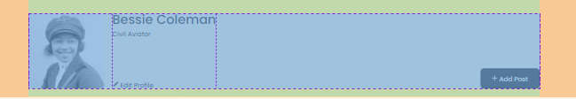
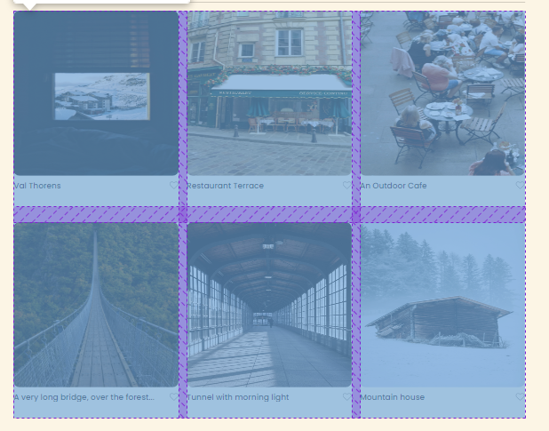
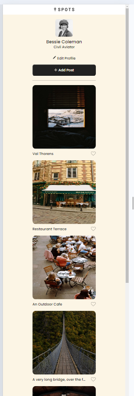

# Project 3: Spots

### Overview

- Intro
- Figma
- Images
- Description
- Technologies and Techniques
- Pictures
- Link to the Deployed Website

**Intro**

This project is made so all the elements are displayed correctly on popular screen sizes. We recommend investing more time in completing this project, since it's more difficult than previous ones.

**Figma**

- [Link to the project on Figma](https://www.figma.com/file/BBNm2bC3lj8QQMHlnqRsga/Sprint-3-Project-%E2%80%94-Spots?type=design&node-id=2%3A60&mode=design&t=afgNFybdorZO6cQo-1)

**Images**

The way you'll do this at work is by exporting images directly from Figma — we recommend doing that to practice more. Don't forget to optimize them [here](https://tinypng.com/), so your project loads faster.

**Description**

Project for learning to do a responsive layout implementing grid properties and combining it with lessons learned from previous sprints.

**Technologies and Techniques**

- grid
- flexbox
- lists
- media queries
- html
- css

**Pictures**

**Link to Deployed Website**

[Deployment Link] (https://mlhmatsuo.github.io/se_project_spots/)

[Video Link](https://drive.google.com/drive/folders/11IoQGVuC1iaOPJZWkZ1yyAEQ56PCOpNc?usp=sharing)
